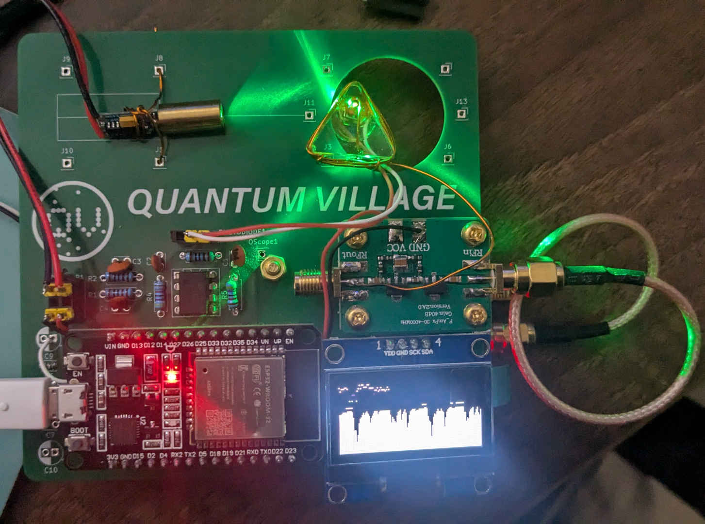

# UNCUT GEMS - Build Guide

This is as comprehensive build guide as we can make for the UNCUT GEMS open source NV center diamond sensor!

Things we don't cover:

- How to solder - lots of help out there for that!
- How to have a PCB manufactured - but we do provide files that should be compatible with most manufacturers, e.g. JLCPCB, PCBWay, etc.
  - For this step, zipping up the contents of the PCB `Prod_files` folder should be enough. 

## Preparing the Epoxy Diamond Mount

This is  thoroughly covered in the section about the hardware, so we'll refer you to that for now. Once you have created your own quantum diamond prism, you can continue from here.

## Note on USB Power

We recommend using an isolated or protected USB supply for testing and operation. Not all computer/laptop USB power circuits are built to handle the occasional faults that may occur, and you may well damage your equipment, as well as the sensor, if care it not undertaken. 

## Populating the PCB

Assuming you have a PCB, we recommend the following steps:

1. We first recommend solding the components for the transimpedence amplifier:
    * First, solder the TL082 dual opamp chip (solder directly or use a DIP chip socket)
    * Next, solder the resistors and capacitors, only adding C1 and C2 if you want to use the opamp as an integrator.
    * Trim the leads on the back.
1. Solder the sockets for the ESP32 dev board, the OLED screen, and the 5V/GND supply 3x2 pin socket block.
1. Next, solder the 5x2 pin socket for the ADF4351 board
    * Note - this socket is soldered **on the back** of the board. So you solder on what is the front of the board. 
1. Before placing the boards, bolt in place some appropritely long brass PCB mounts. 
1. First, plug in the ESP32 and power up: 
    * Check that a steady 5V is coming from the 5V supply socket
    * 3.3V from the socket for the ADF4351 board. 
    * Check that the legs of R1 and R2 have the correct voltage divider voltages; 5V, 2.5V, and 0V.
    * If any of these aren't correct, check for shorts!
1. Compile and upload the firmware to the ESP32.
1. With this successful, mount the ADF4351 to the back, and the RF amplifier board to the front of the PCB.
    * The mounting for these overlap but are on different sides of the board.
    * The silkscreen on the front of the PCB should match the pin definitions on your development board. 
1. Connect the ADF4351 and RF amplifier with a standard, short length, socket SMA to socket SMA cable. 
1. Test the board so far:
    * Apply a short antenna to the free side of the RF amplifier (if available).
    * Power up the board and check that the `LOCK` LED lights up.
    * If this is fine, then check the frequency is as described in the firmware mode you have selected. 
        * Most of the hardcoded modes centre around 2880MHz.
1. Plug in the laser module to the 5V/GND socket paying close attention to polarity! 
1. Plug in the photodiode connector from the assembled diamond holding prism.
1. Connect the microwave antenna to the RF amplifier output. 
    * If you have crimped an SMA connector, then you can just screw this onto the mounted connector on the RF amplifier board.
    * If you have not, then you may carefully solder the antenna wire to the output pin of the same connector.
    * Carefully inspect the soldering joint to ensure no short circuits have been intruduced. 
1. At this point **TRIPLE CHECK FOR ELECTRICAL SHORTS** before powering on! At this point, an uninteded short can damage all three of the daughter boards. 
1. Plug in the OLED screen board and power up - if the text `Calibrating...` is shown, then the device is working!  

If the board powers on find after all this, and all checks are passed, then you should proceed to aligning!

## Aligning the Laser and Diamond

The simplest way is to mount the lasers on some enameled copper wire, and use the structural properties therein to hold the laser and epoxy prism in place. 

**NB** - you **MUST** use enameeled copper wire, else you will create shorts that will definitely damage your device and any device it is connected to! 

When aligning, use Red laser goggles or a sample of red filter gel to align the laser such that the diamond is shining very brightly with red light!

## Completed Board

The finished assembled board should look like this:

## Testing and Operation

To test the magnetometery we recommmend the following initial 'signs of life' test:

1. Turn off as many environmental/ambient lights as possible. 
1. Power the device and check that the lower half of the screen is showing a pattern.
    * If not, connect to the serial port and check there is data coming from the device. 
1. Move a small magnet near the diamond and check it registers.
1. To confirm the magnet is causing the change, place a small cutout of paper over the top of the prism (to block light changes) and repeat moving a magnet close. 

If all this has been successful - **CONGRATULATIONS!!** 

