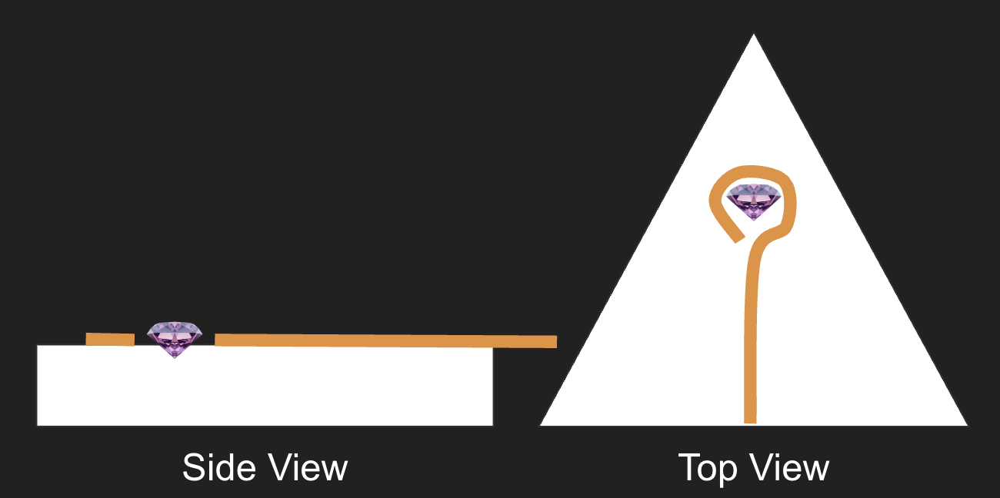
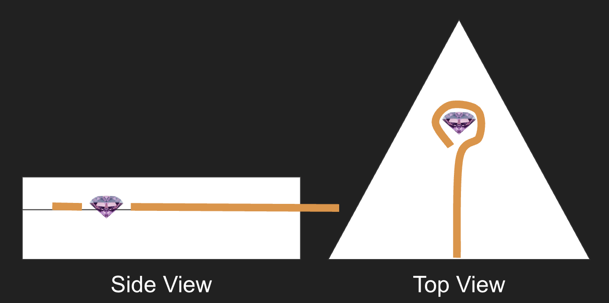
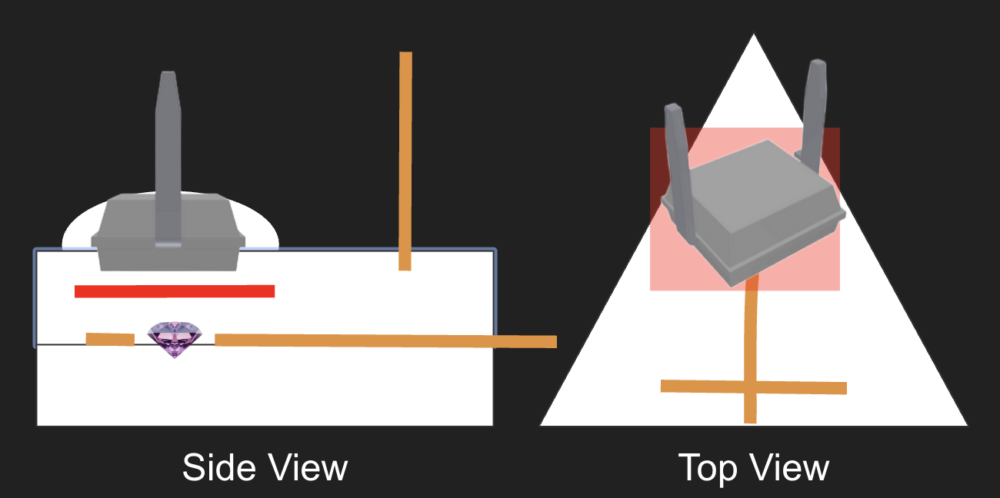
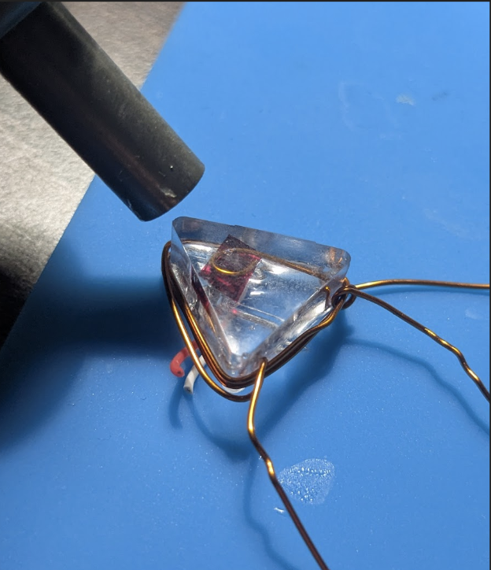

# Diamond Mounting

This document captures the information surrounding the development of the diamond mount.

## Core Components 

There are 5 main components:

1. The Diamond itself
2. The epoxy block containing it
3. The aerial wire for the microwave signal
4. The photodiode placement
5. The red gel light filter.

### The 'Secret' Behind the Build

The open secret in this build is to essentially use parts that are designed for jewellery making. The silicone moulds, UV epoxy, and use of 24AWG copper wire are all common components in craft jewellery making - the kind found on Etsy or similar. So if you cannot acquire precisely the parts we list here, then you can always search for substitutes that are used in this production style.

### The Diamond

The diamond is ~750um in size - essentially a large grain of salt/small grain of sand in size. It is a purple-ish colour, brought on by the presence of the N-vacancy centers. The important thing to remember is that this is an inert rock that can convert green light @ ~520nm into red light @ ~620nm in the presence of several bands of microwave frequencies. These may be acquired but only in bulk from companies like [Element Six](https://e6.com) and [Adamas Nano](https://www.adamasnano.com/).

### Epoxy block containing it

The epoxy that we have eventually worked out is best is UV cured clear epoxy. Clear epoxy has reasonably good optical properties, and UV cured epoxy (e.g. [of this kind on Amazon.co.uk](https://www.amazon.co.uk/Ultraviolet-Jewellry-Necklaces-Bracelets-Accessories/dp/B0BWT7JNYT/)) is widely available. We make use of UV cured epoxy for fast iteration and prototyping. Whilst slower setting epoxies may have slightly nicer chemical properties for other applications, the use of very stable materials (diamond, copper, plastic film) means that faster setting epoxy is perfectly fine to use.

The epoxy is best moulded in silicone moulds - we used some of the smaller slightly thicker shaped moulds from a 'epoxy jewellery mould kit' we found on Amazon (sadly no longer available). There are also useful mould sizes advertised for use in making sweets/confectionary or for moulding small chocolates. All of the ones that are useful are usually in the size range of 10-20mm. 

### Aerial wire for the microwave signal

24AWG enameled copper wire is used for two things in this build - structural holding of the epoxy block, and delivering the microwave signal. The signal aerial has to have a small loop formed in the end, and this is placed around the diamond during the layering. This delivers the best signal - we have tried many designs from simple junctions to more adventurous designs, but this was by far uniformly the best design we found! 

### Photodiode placement

Instead of using optics (mirrors, beam splitters, etc) we place the photodiode, a BPW34 photodiode that we purchased on eBay, directly below the diamond and very close to it. This is because the BPW34 has a relatively large detection surface of 3x3mm. This means that if it is close enough, it will acquire most of the light emitted by one side of the diamond. The BPW is epoxy mounted directly below the diamond for this purpose.

### Red gel light filter

There is evidence in PAPER LINK that a red-gel filter, the kind used in theatre or photographic lighting, is 'mostly' as effective as professional grade dichroic mirrors (which let one light band pass through and reflect the rest). As such, we were able to place this layer interstitially between the diamond and covering the photodiode detection surface completely. In experimenting we found that only 1 layer was needed in order to acquire meaningful signal. 

## Construction

We do this in three epoxy pours, which we'll describe in turn. The diagrams are purely illustrative, and are not drawn to scale.

### Layer 1

First lay down a layer of epoxy and proceed to harden it. Once done, carefully place the diamond in the middle of the antenna loop on top of this layer.

### Layer 2

Once the diamond and antenna are in place, proceed to pour another layer of epoxy over the top. We use toothpicks to maneuvre things into just the right positions before hardening again. 

### Layer 3

With the diamond now set, we carefully place a 5x5mm square of red filter over the diamond. The photodiode should then be placed directly over the diamond, with the diamond central to the sensor area.

Once this is done, we then pour the rest of the epoxy and place any copper supports or mechanical fixings into this layer, before hardening. 

Often, we reinforce the photodiode with an extra blob of epoxy around it to make sure it is immovable. 

### Decapsulating the Diamond

Should you need to fix an error, whilst the photodiode, red filter, and copper wire may be very hard to retrieve from the epoxy, the diamond is very easy to retrieve; many epoxies (such as the one above) soften at around 200C, so we simply use a small hot air device to heat the epoxy prism until it is soft, and then use pointed tweezers to retrieve the diamond. 

This method is relatively mess-free and quite safe. We have yet to damage a diamond in this process. The other components are more hit-and-miss as to whether they can be retrieved this way. 
